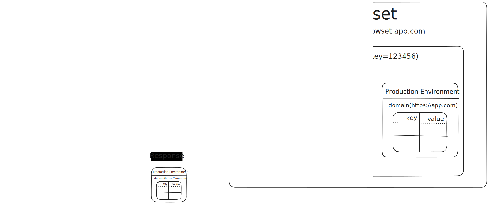

# Browset

Browset is an open-source web platform designed to configure environment variables for web frontends. It simplifies the process of managing environment-specific configurations, making it easier to deploy applications across different stages like UAT and Production without the need for complex implementation or rebuilds.


## Why We Need Browset?

Managing environment variables for web frontends can be cumbersome and complex, especially when deploying across multiple stages. Traditional methods often require intricate setups and rebuilds for each environment, as outlined in this [article](https://www.freecodecamp.org/news/how-to-implement-runtime-environment-variables-with-create-react-app-docker-and-nginx-7f9d42a91d70). Browset addresses this issue by providing a streamlined and efficient solution, eliminating the need for such complex implementations.

## How Browset Solves the Problem?



Browset allows you to create a project, providing a unique random key to access the GET request API endpoint (`/api/v1/environments/variables/{project-key}`) to retrieve environment variables. You can then create environment variables for each stage within that project. For instance, if your web frontend has two stages (UAT and Production), you can define the environment variables for each stage as follows:

### UAT

- **Domain**: [https://uat.mywebsite.com](https://uat.mywebsite.com/)
- **Environment Variables**: `API_URL=https://api.uat.mywebsite.com`

### Production

- **Domain**: [https://mywebsite.com](https://mywebsite.com/)
- **Environment Variables**: `API_URL=https://api.mywebsite.com`

Once the environment variables are created for each stage of the project, you can integrate Browset with your web frontend to load the environment variables dynamically.

### Example Integration

Assume your Browset platform is hosted at `https://browset-server.com`. In your web frontend, make a GET request to `https://browset-server.com/api/v1/environments/variables/{project-key}`. The response will provide the environment variables in JSON format as key-value pairs.

For example:

- **Request from UAT**: If you make a request from `https://uat.mywebsite.com`, you will receive:
  ```json
  {
    "API_URL": "https://api.uat.mywebsite.com"
  }
  ```
- **Request from Production**: If you make a request from `https://mywebsite.com`, you will receive:
  ```json
  {
    "API_URL": "https://api.mywebsite.com"
  }
  ```

This dynamic response based on the origin domain ensures that you don't need to rebuild your web frontend each time you deploy to a different stage or update a variable. With Browset, you build once and run anywhere.

## Benefits of Using Browset

- **Simplifies Environment Management**: Manage environment variables effortlessly across different stages.
- **No Rebuilds Required**: Deploy updates without the need for rebuilding the frontend.
- **Dynamic Configuration**: Environment variables are dynamically served based on the origin domain.
- **Streamlined Process**: Reduces the complexity involved in traditional methods of managing environment-specific configurations.

## Tech Stack

Browset leverages the following technologies:

- [**AdminJS**](https://adminjs.co/): A powerful admin panel for managing your application's data and settings.
- [**NestJS**](https://nestjs.com/): A progressive Node.js framework for building efficient and scalable server-side applications.
- [**Prisma**](https://www.prisma.io/): A next-generation ORM that simplifies database access.
- **Postgres**: A powerful, open-source relational database.

## Getting Started

### Run with Docker Compose

1. **Pull the Project**:

   ```bash
   git pull https://github.com/your-repo/browset.git
   ```

2. **Install Docker**: If you don't have Docker installed, follow the instructions here.
3. **Update Environment Variables**: Edit the `docker-compose.yml` file as needed.
4. **Run Docker Compose**:

   ```bash
   docker-compose up
   ```

5. **Access the Project**: The project will be running on port 3000 by default.

### Run without Docker

1. **Pull the Project**:

   ```bash
   git pull https://github.com/minuth/browset.git
   ```

2. **Create .env File**: Copy all key-values from `.env.example` to a new `.env` file and edit the values based on your configuration.
3. **Install Dependencies**:

   ```bash
   bashCopy code
   yarn
   ```

4. **Apply Migrations**:

   ```bash
   npx prisma migrate deploy
   ```

5. **Build the Project**:

   ```bash
   yarn build
   ```

6. **Start the Project**:

   ```bash
   yarn start
   ```

7. **Access the Project**: The project will be running on port 3000 by default.

### Access the Admin Panel

- Now you can access the admin panel at `http://localhost:3000/admin`.
- After logging in, you can start creating a project and setting up environment variables for each stage.

### Testing Environment Variables

After setting up environment variables for each stage, you can test the API to ensure that the environment variables are correctly responded to based on the request origin domain. Use `curl` to simulate the origin header in the request.

For example:

- **Testing UAT Environment**:
  ```bash
  curl -H "Origin: https://uat.mywebsite.com" http://localhost:3000/api/v1/environments/variables/{project-key}
  ```
- **Testing Production Environment**:
  ```bash
  curl -H "Origin: https://mywebsite.com" http://localhost:3000/api/v1/environments/variables/{project-key}
  ```

With Browset, managing environment variables for your web frontend becomes a hassle-free and efficient process. Start using Browset today and simplify your deployment workflows!
